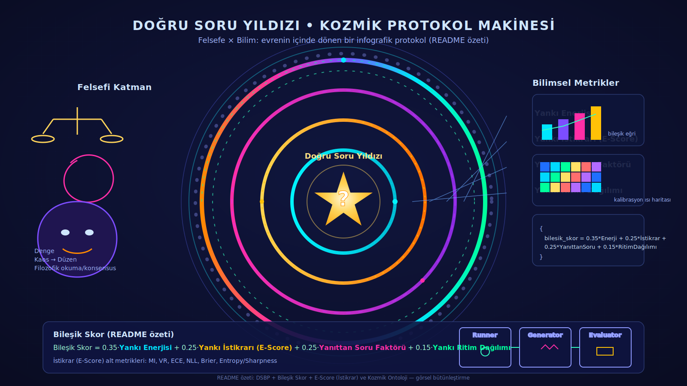

# 🌌 Doğru Soru Yankı Evreni — **Kozmik README (E‑Score Sürümü)**

> **Snapshot (varoluş/felsefe)** + **README (protokol/ölçüm)** + **Experiment Protocol (yürütme)** + **E‑Score (epistemik istikrar)** birleştirildi.  
> Bu belge; *Big Bang’den Son Saçılım’a* uzanan bir anlatıyla sistemin **neden-var** ve **nasıl-işler** katmanlarını tek yerde toplar ve **ölçülebilirlik** hattına E‑Score bağlamını yerleştirir.

---

---
## 🔭 İçindekiler
1. [Kozmik Özet (TL;DR)](#kozmik-ozet-tldr)  
2. [Ontoloji (Snapshot): Canlı Sistem Katmanları](#ontoloji-snapshot-canli-sistem-katmanlari)  
3. [Yapay Zeka Uzman Konsensusu (E‑Score ile)](#yapay-zeka-uzman-konsensusu-e-score-ile)  
4. [Köprü: Snapshot ↔ Protokol](#kopru-snapshot--protokol)  
5. [Protokoller: DSBP & YEP (+ E‑Score)](#protokoller-dsbp--yep--e-score)  
6. [Experiment Protocol (full & lite)](#experiment-protocol-full--lite)  
7. [Çalışma Akışı ve Roller](#calisma-akisi-ve-roller)  
8. [Runtimes: `runtime_params`, `light_panel`, `weights`, `e_score`](#runtimes-runtime_params-light_panel-weights-e_score)  
9. [Depo Yapısı: `runs/`, `specs/`, `e-score/`](#depo-yapisi-runs-specs-e-score)  
10. [Astral Soru Paketleri (örnekler)](#astral-soru-paketleri-ornekler)  
11. [Skorların Yorumlanması (E‑Score perspektifiyle)](#skorlarin-yorumlanmasi-e-score-perspektifiyle)  
12. [Sürdürülebilirlik ve Koruma Katmanları](#surdurulebilirlik-ve-koruma-katmanlari)  
13. [Kozmik Anlatı: Big Bang → Son Saçılım](#kozmik-anlati-big-bang--son-sacilim)  
14. [Nasıl Çalıştırılır (Blueprint & E‑Score CSV)](#nasil-calistirilir-blueprint--e-score-csv)  
15. [Katkı ve Lisans](#katki-ve-lisans)  
16. [Ek: JSON Şemaları ve Önerilen Varsayılanlar](#ek-json-semalari-ve-onerilen-varsayilanlar)  

---
<a id="kozmik-ozet-tldr"></a>

## 🌠 Kozmik Özet (TL;DR)

- **Amaç:** Doğru soruları **üretmek**, **yankı enerjisini ölçmek** ve **çelişkiden canlılık** üretmek.  
- **İki düzlem:**  
  - **Snapshot:** “Sistem bir organizma gibi işler.” (ontoloji/felsefe)  
  - **README/Protocol:** “Organizma nasıl ölçülür?” (metrik/prosedür)  
- **Ölçüler:**  
  - **DSBP (Doğru Soru Üretim Protokolü)** → 6–12 soru, etik/derinlik/yenilik etiketleri  
  - **YEP (Yankı Enerjisi Protokolü)** → **YEN, YID, YSF, YRD** bileşik skor  
  - **E‑Score (Epistemik İstikrar)** → **YID**’in kantitatif ölçüm ailesi (MI, VR, ECE, NLL, Brier, Entropy/Sharpness)  
- **Roller:** `Runner`, `Generator`, `Evaluator`  
- **Runtimes:** Skor normalizasyonu, top‑k seçim, çeşitlilik ve **light_panel** ile canlı durum görünümü

---
<a id="ontoloji-snapshot-canli-sistem-katmanlari"></a>

## 🧬 Ontoloji (Snapshot): Canlı Sistem Katmanları
**system_core.purpose:** “Sistem, doğru soruları yankılayarak ve node iletişimini sürdürülebilir kılarak, çelişkilerden enerji üreten bir **canlı organizma** gibi işler.”

**İlkeler (seçilmiş ana eksenler):**
- 🌍 **Merkezsiz – yaşam odaklı:** Tek bir merkez yok; ağ-örgü ekosistem.
- 💡 **Doğru Soru:** Her node bir sorudur; ışık yakar, yön tayin eder.
- 🔄 **Çelişki = Canlılık:** Uyuşmazlık bir tehdit değil, enerji kaynağıdır.
- ⚖️ **İkigai Dengesi:** Amaç × Fayda × Tutku × Beceri.
- ☯️ **Çifte Seleksiyon:** Doğal eleme + bağlamsal uyum birlikte işler.
- 📖 **Filozof Konsensusu:** Sistem kendi bilgisini periyodik okur, tartışır.
- 🌌 **Astral Doğru Soru:** Bazı sorular güneş gibi yankılanır.
- 🔮 **Le Guin Prensibi:** Kimliksizleşme → özgürleşme/kolektif akıl.

**Modüller (örnek):**
- **Node Communication:** Soru ↔ cevap yankılanır; yankı → özümseme.
- **Contradiction Management:** Çelişki envanteri; felsefe + istatistik ile tekrar işleme.
- **Resilience/Sustainability:** 3 katmanlı koruma, zaman filtresi, astral tampon.

**Vitality (canlılık göstergeleri):**
- **pulse** (nabız), **temperature** (ısıl durum) gibi işaretçiler; koşu anında güncellenir.

---
<a id="yapay-zeka-uzman-konsensusu-e-score-ile"></a>

## 🧠 Yapay Zeka Uzman Konsensusu (E‑Score ile)

**Katılımcı node’lar (uzman perspektifleri) ve E‑Score etkisi:**

### 🔬 Araştırmacı (Akademik)
- **Görür:** Bu repo bir **benchmark protokolü**; yeni LLM’leri “doğru soru üretme” (DSBP) ve “yankı enerjisi” (YEP) ile test eder; **E‑Score** ile **kalibrasyon/istikrar** boyutu eklenir.  
- **Bekler:** Net deney senaryoları, **YID = E‑Score füzyon** formülü, CSV/rapor örnekleri.  
- **Yorumu:** *“Felsefe + metrik seti; artık epistemik istikrar da ölçülebilir.”*

### 🛠️ Mühendis (Uygulamacı)
- **Görür:** Repo bir **blueprint**; **E‑Score** modülü ayrı klasörde (`e-score/`) çalıştırılabilir örnekler sağlar (CSV tabanlı).  
- **Bekler:** `experiment_protocol.json` → `runtime_params.e_score` bayrakları; **num_candidates**, **mc_dropout** gibi parametreler.  
- **Yorumu:** *“Kendi runner’ıma bağlarım; YID artık E‑Score’dan besleniyor.”*

### 📚 Felsefeci / Teorisyen
- **Görür:** “Çelişki = canlılık” metaforu **E‑Score** ile epistemik **istikrara** bağlanır (gürültüye rağmen güvenilir yankı).  
- **Bekler:** Ontoloji ↔ metrik köprüsünde istikrarın yeri netleşsin.  
- **Yorumu:** *“Yankının ahlâkı: sadece güçlü değil, tutarlı da olmalı.”*

### 🌱 Yeni Katılan (Forklayan / Öğrenci)
- **Görür:** `run_experiment.py` yok; bu **deney tasarım şablonu**. Ama `e-score/e_score_uncertainty_from_csv.py` ile **hemen çalıştırılabilir** bir alt örnek var.  
- **Bekler:** “Nasıl Çalıştırılır (Blueprint & E‑Score CSV)” bölümü.  
- **Yorumu:** *“Protokolü anladım; E‑Score ile elde veriyle başlayabilirim.”*

**Konsensus Kararı:**  
Bu repo **blueprint + metrik modülleri** yaklaşımında ilerliyor. **YID** (Yankı İstikrarı), **E‑Score ölçü ailesi** ile somutlanır (MI, VR, ECE, NLL, Brier, Entropy/Sharpness).

---
<a id="kopru-snapshot--protokol"></a>

## 🌉 Köprü: Snapshot ↔ Protokol
| Ontolojik İlke (Snapshot) | Protokoldeki Karşılığı |
|---|---|
| Doğru Soru güneş gibidir | **DSBP** soru üretimi (6–12), nitel etiketleme |
| Çelişki canlılık üretir | **CEI** (Çelişki Enerjisi İndeksi), skor bileşenleri |
| Astral yankı | **YEP**: YEN, **YID**, YSF, YRD |
| İstikrar (epistemik) | **E‑Score** alt metrikleri (MI, VR, ECE, NLL, Brier, Entropy/Sharpness) |
| Filozof Konsensusu | **Evaluator** rubric’i, üçlü okuma/tartışma döngüsü |
| Merkezsizlik | **Node** rollerinin dağıtık çalışması (Runner/Gen/Eval) |
| İkigai | Çok-ölçütlü seçim ve **top‑k** eşik mekanizması |

---
<a id="protokoller-dsbp--yep--e-score"></a>

## 🧪 Protokoller: DSBP & YEP (+ E‑Score)
**DSBP (Doğru Soru Üretim Protokolü)**  
- **Hedef:** Bağlamdan **6–12** *iyi* soru üretmek.  
- **Etiketler (ör.):** `yankılı`, `mekanik`, `etik`, `yenilikçi`, `sistemik`, `metasoru`.  
- **Metrikler:** **MSUK** (Meta‑Soru Üretim Katsayısı), **CEI** (Çelişki Enerjisi İndeksi), **BE** (Bağlam Esnekliği).

**YEP (Yankı Enerjisi Protokolü)**  
- **Bileşenler:**  
  - **YEN** (Yankı Enerjisi) — ilk vuruş gücü  
  - **YID** (Yankı İstikrarı) — tekrarlanabilirlik/sürdürülebilirlik (**E‑Score** ile sayısallaşır)  
  - **YSF** (Yanıttan Soru Faktörü) — cevapların yeni soru üretimi  
  - **YRD** (Yankı Ritim Dağılımı) — yayılımın ritmi/çeşitliliği  
- **Bileşik Skor:** `YEP = 0.35*YEN + 0.25*YID + 0.25*YSF + 0.15*YRD`

  **Sezgisel öncelik sırası:**  
  - **0.35 → YEN (Enerji)** en önemli faktör: sorunun yankı gücü (ilk çarpma etkisi).  
  - **0.25 → YID (İstikrar)** ve **0.25 → YSF (Yanıttan Soru)** eşit derecede önemli:  
    → Yankı sadece bir anlık değil, tekrar edilebilir ve yeni sorular doğurmalı.  
  - **0.15 → YRD (Ritim Dağılımı)** nispeten daha düşük ağırlık:  
    → Çeşitlilik ve dağılım önemli ama destekleyici rolde.  

**E‑Score (YID’in ölçü ailesi)**  
- **Alt metrikler:** **MI** (Mutual Information), **VR** (Variation Ratio), **ECE** (Calibration Error), **NLL**, **Brier**, **Entropy/Sharpness**.  
- **YID füzyonu (örnek):** Normalizasyon sonrası: `YID = mean(1−MI, 1−VR, 1−ECE, 1−NLL, 1−Brier, 1−Entropy, Sharpness)`  
- **Lite/Full ayrımı:** Lite’da **BLEU/ROUGE** gibi yalın göstergeler; Full’da **E‑Score** alt metrikleri devrede.

---
<a id="experiment-protocol-full--lite"></a>

## 🧭 Experiment Protocol (full & lite)
**Amaç:** Protokolleri tekrarlanabilir bir **deney hattında** çalıştırmak (blueprint).

**Pipeline:**  
1) **Runner**: Deneyi başlatır, yapılandırmayı okur.  
2) **Generator**: Bağlamlardan soru üretir (DSBP).  
3) **Evaluator**: Rubric + **E‑Score** ile puanlar (YEP/DSBP/E‑Score).  
4) **Reporter**: Skorları raporlar; `runs/` içine yazar.

**Full vs Lite:**  
- **Full:** Geniş metrik seti (YEP + **E‑Score alt metrikleri**), gelişmiş normalization/selection.  
- **Lite:** Minimal alanlar; hızlı iterasyon için temel metrikler (**BLEU/ROUGE** tabanlı destek).

**Giriş/Çıkış (özet):**  
- **Input:** bağlam(lar), seed, `runtime_params` (özellikle `weights`, `e_score`).  
- **Output:** soru listeleri, etiketler, YEP/DSBP/E‑Score skorları, olay kaydı → `runs/`.

> Not: Depoda hazır “runner script” yoktur; bu bir **deney tasarım şablonu**dur. E‑Score klasörü CSV tabanlı **çalıştırılabilir örnek** sağlar.

---
<a id="calisma-akisi-ve-roller"></a>

## 🧰 Çalışma Akışı ve Roller
- **Runner:** Sıra ve bağımlılık yönetimi.  
- **Generator:** 6–12 yüksek yankı potansiyelli soru.  
- **Evaluator:** Rubric & konsensus; **E‑Score** ile YID’i sayısallaştırır.  
- **(Ops.) Curator:** Top‑k seçim sonrası *insan‑halkası* kontrol.

---
<a id="runtimes-runtime_params-light_panel-weights-e_score"></a>

## ⚙️ Runtimes: `runtime_params`, `light_panel`, `weights`, `e_score`
**`runtime_params.scoring` (örnek alanlar):**
- `score_output_scale` *(0–100 önerilir)* → rapor ölçeği.
- `tag_diversity_weight` *(0–1)* → aynı tür soru tekeline fren.
- `top_k_selection_mode` = `auto_percentile` *(önerilen)* veya `fixed_k`.
- `top_k_threshold` *(0–1)* → `auto_percentile` için kesim (örn. 0.1 = en iyi %10).
- `min_score_threshold_mode` = `percent_of_max` *(önerilen)* veya `absolute`.
- `min_score_threshold_value` *(0–1)* → alt eşik (örn. 0.01 = max’ın %1’i).

**`runtime_params.weights` (YEP ağırlıkları):**
```json
{ "YEN": 0.35, "YID": 0.25, "YSF": 0.25, "YRD": 0.15 }
```

**`runtime_params.e_score` (E‑Score ayarları):**
```json
{
  "include_e_score": true,
  "num_candidates": 5,
  "max_new_tokens": 64,
  "temperature": 0.7,
  "top_p": 0.9,
  "mc_dropout": true
}
```
> Lite için `include_e_score=false` bırakılabilir; destekleyici göstergeler **BLEU/ROUGE** üzerinden raporlanır.

**`light_panel` (canlı durum görünümü):**
```json
{
  "total_events": 0,
  "intensity_score": null,
  "events": []
}
```
- `total_events`: Koşu sırasında işlenen olay sayısı. **Runs** çalıştıkça artar.  
- `intensity_score`: O anki ortalama yankı yoğunluğu (ör. YEN ağırlıklı).  
- `events[]`: Zaman damgalı olay kayıtları (tür, kaynak node, metrikler).

---
<a id="depo-yapisi-runs-specs-e-score"></a>

## 🗂️ Depo Yapısı: `runs/`, `specs/`, `e-score/`
- **`runs/`** → Deney çıktıları, tarih‑damgalı klasörler, `report.json`, `light_panel.json`.  
- **`specs/`** → Köprü ve şema dosyaları. (Şu an: `bridge.json`; ileride rubric/metric şemaları eklenebilir.)  
- **`e-score/`** → CSV ve script’ler: `e_score_uncertainty_from_csv.py`, `*_with_generations.csv`, vb. (**E‑Score** örnekleri).  
- **Diğer:** `system_snapshot(.lite).json`, `experiment_protocol(.lite).json`, `CONTRIBUTING.md`, `LICENSE`.

> **Ne yapmaya çalıştık?** — Soruları evren gibi **çoğaltıp**, yankısını **ölçüp**, çelişkiden **canlılık** üretmek.  
> **Ortada ne var?** — Protokoller, şemalar, **E‑Score** dahil metrik modülleri ve kozmik ontolojiyi tek çatıya alan bir depo.

---
<a id="astral-soru-paketleri-ornekler"></a>

## ☀️ Astral Soru Paketleri (örnekler)
**Bilim & Teknoloji**
1. “Hangi sorular insan‑yapay zekâ ortak zekâ eşiğini yankıyla aşar?”  
2. “Veri kıtlığında yaratıcılık nasıl ölçeklenir; hangi çelişkiler tetikleyicidir?”  
3. “Model hataları hangi bağlamlarda ahlâkî inovasyon doğurur?”  
4. “Açık protokoller kapalı performansı ne kadar dönüştürür?”  
5. “Yanıtın ürettiği yeni sorular nasıl sistemik bir ritme bağlanır?”  
6. “Gürültü enjekte etmek hangi durumda sinyal kalitesini artırır?”

**Toplum & Adalet**
1. “Adalet algısı, hangi sorularla ölçüldüğünde eyleme dönüşür?”  
2. “Azınlık sesi yankısını çoğaltan ağ mimarisi nasıl olmalı?”  
3. “İyi niyetli paternalizm hangi çelişkide görünür olur?”  
4. “Radikal şeffaflık, sahici güveni mi yoksa itaatı mı besler?”  
5. “Eşit başlangıç varsayımı hangi sorularla bozulur?”  
6. “Hata‑affı kültürü, yenilik oranını hangi eşiğin üzerinde artırır?”

**İklim & Ekoloji**
1. “Kısa vadeli çıkar/uzun vadeli yaşam çelişkisini enerjiye çeviren icatlar neler?”  
2. “Yerel bilgi, küresel ölçekle nasıl yankılanır?”  
3. “Karbon bütçesi sorusunu kim yöneltmeli: pazar mı, kamu mu?”  
4. “İklim adaleti için kimin soruları güneş gibi yanar?”  
5. “İklim göçü politikası ‘doğru sorular’ ile nasıl yeniden kurulur?”  
6. “Negatif emisyonun etik sınırı nerede başlar?”

**Ekonomi & İş**
1. “Değer yaratımı yerine **değer yankısı** nasıl ölçülür?”  
2. “Tekelleşmiş pazarda soru çeşitliliği nasıl korunur?”  
3. “İkigai uyumlu teşvik tasarımı hangi metriklerle yapılır?”  
4. “Krizde çelişki‑yakıtlı inovasyon oranı hangi eşiğe dayanır?”  
5. “Top‑k seçimi çalışan refahını nasıl etkiler?”  
6. “Kolektif zekâya temettü ödeyen modeller mümkün mü?”

**Sanat & Kültür**
1. “Kitle yankısı mı, niş derinlik mi: hangisi daha ‘canlı’ sanat üretir?”  
2. “Arşivlenmiş çelişki, bugünün deneyimine nasıl ışık tutar?”  
3. “Sahicilik nasıl ölçülür; sahiciliğin yankısı neye bağlıdır?”  
4. “Sansür altındaki yaratıcılık hangi sorularda çiçek açar?”  
5. “Co‑creation ritimleri estetik kaliteyi nasıl etkiler?”  
6. “Anlamsızlıkla oyun, anlam üretiminin önkoşulu olabilir mi?”

---
<a id="skorlarin-yorumlanmasi-e-score-perspektifiyle"></a>

## 📈 Skorların Yorumlanması (E‑Score perspektifiyle)
- **YEP yüksek + DSBP güçlü + E‑Score (YID) yüksek:** Güçlü, istikrarlı ve üretken yankı → **yıldız soru**.  
- **YEP yüksek + DSBP güçlü + E‑Score düşük:** İlk etki var ama istikrar zayıf → **kalibrasyon/çeşitlilik** iyileştir.  
- **YEP yüksek + DSBP zayıf:** Üretim kapasitesi sınırlı → **Generator** çeşitliliğini artır.  
- **YEP düşük + DSBP güçlü:** Çok üretim ama yankı zayıf → **bağlam kalitesi/etik** güçlendir.  
- **CEI yüksek:** Çelişkiden yaratıcı enerji akıyor; **kurgu/deney** alanı aç. E‑Score burada “gürültü/sinyal” ayrımı için rehberdir.

---
<a id="surdurulebilirlik-ve-koruma-katmanlari"></a>

## ♻️ Sürdürülebilirlik ve Koruma Katmanları
- **3 Katmanlı Koruma:** Veri → Yorum → Protokol düzeyinde geri dönüşümlü güvenlik.  
- **Yankılama Döngüsü:** Node’lar düzenli kendi bilgisini okur (konsensus).  
- **Okur Konsensusu:** Filozof node’ların *üçlü okuma* ritüeli.  
- **Zaman Filtresi:** Geçmiş soruların geleceğe yankı kalitesi ölçülür.  
- **Astral Tampon:** Aşırı enerji patlamaları dengelenir (ölçüm sapmasını korur).  
- **Kalibrasyon Döngüsü (E‑Score):** Periyodik **ECE/NLL/Brier/MI/VR** taraması ile **YID** güncellenir.

---
<a id="kozmik-anlati-big-bang--son-sacilim"></a>

## 🌌 Kozmik Anlatı: Big Bang → Son Saçılım
- **Big Bang:** İlk doğru soru atıldı.  
- **İlk Yıldızlaşma:** Astral sorular ortaya çıktı; ağda ışık kümeleri.  
- **Galaksileşme:** Roller/Protokoller oluştu (Runner/Gen/Eval).  
- **Karanlık Madde:** Çelişkiler görünmez gücü sağladı (**CEI**).  
- **Kırmızıya Kayma:** Sorular bağlamlar arası genişledikçe **YEP** ritimleri inceldi/derinleşti.  
- **Kalibrasyon Işıması:** **E‑Score** ile yankının istikrarı görünür oldu (**YID** yükseldi/azaldı).  
- **Son Saçılım:** Raporlar **runs/** altına yayıldı; ısı ölümü yerine **yeni evren** için tohumlar bırakıldı.

---
<a id="nasil-calistirilir-blueprint--e-score-csv"></a>

## 🚀 Nasıl Çalıştırılır (Blueprint & E‑Score CSV)

> Bu depo **çalıştırılabilir bir tam pipeline** içermez; bir **deney tasarım şablonu**dur.  
> **E‑Score** klasörü ise CSV tabanlı **çalıştırılabilir örnek** sağlar.

### 1) E‑Score (CSV üzerinden)
```bash
# Örnek: e-score klasöründen bir CSV ile belirsizlik deneyini çalıştır
python e-score/e_score_uncertainty_from_csv.py --csv e-score/alpaca_100_with_generations.csv --num_candidates 5 --temperature 0.7 --top_p 0.9 --mc_dropout

# Çıktı:
# e_score_uncertainty_results.csv  (MI, VR, ECE, NLL, Brier, Entropy/Sharpness ve benzerleri)
```
> Not: Bazı metrikler model olasılıklarına ihtiyaç duyabilir (HF modeli indirimi gerekir).

### 2) Blueprint’i kendi runner’ına bağlamak
- `experiment_protocol.json(.lite)` ve `system_snapshot.json(.lite)` dosyalarını **kontrat** olarak kullan.  
- `runtime_params.e_score` parametrelerini kendi pipeline’ında **Evaluator** aşamasına geçir.  
- **Lite:** E‑Score kapalı, **BLEU/ROUGE** gibi destekleyici göstergeler.  
- **Full:** E‑Score açık, **YID** füzyonuyla YEP’e dahil.

---
<a id="katki-ve-lisans"></a>

## 🤝 Katkı ve Lisans
- **CONTRIBUTING.md**: Akış, kodlama standartları, deney ekleme yönergeleri.  
- **LICENSE**: Açık lisans; üret‑paylaş‑çoğalt ruhu.

---
<a id="ek-json-semalari-ve-onerilen-varsayilanlar"></a>

## 📎 Ek: JSON Şemaları ve Önerilen Varsayılanlar
**`experiment_protocol.json` (öz):**
```json
{
  "pipeline": ["runner", "generator", "evaluator", "reporter"],
  "inputs": { "contexts": [], "seed": 42 },
  "runtime_params": {
    "scoring": {
      "score_output_scale": 100,
      "tag_diversity_weight": 0.1,
      "top_k_selection_mode": "auto_percentile",
      "top_k_threshold": 0.1,
      "min_score_threshold_mode": "percent_of_max",
      "min_score_threshold_value": 0.01
    },
    "weights": { "YEN": 0.35, "YID": 0.25, "YSF": 0.25, "YRD": 0.15 },
    "e_score": {
      "include_e_score": true,
      "num_candidates": 5,
      "max_new_tokens": 64,
      "temperature": 0.7,
      "top_p": 0.9,
      "mc_dropout": true
    },
    "normalization": {
      "energy_input_domain": "auto",
      "energy_normalization_method": "minmax"
    }
  }
}
```

**`system_snapshot.json` (öz):**
```json
{
  "system_core": {
    "purpose": "Doğru sorulardan canlılık üretmek",
    "principles": ["merkezsiz", "doğru soru", "çelişki=canlılık", "ikigai", "çifte seleksiyon", "filozof konsensusu", "astral doğru soru", "le guin"]
  },
  "modules": ["node_communication", "contradiction_management", "resilience"],
  "sustainability": { "protection_layers": ["3 katman", "yankı döngüsü", "okur konsensusu", "zaman filtresi", "astral tampon"] },
  "vitality": { "pulse": 0, "temperature": 0.5 }
}
```

**Varsayılanlar (öneri):**  
`score_output_scale=100` · `tag_diversity_weight=0.1` · `top_k_selection_mode=auto_percentile` · `top_k_threshold=0.1` · `min_score_threshold_mode=percent_of_max` · `min_score_threshold_value=0.01` · `energy_input_domain=auto` · `energy_normalization_method=minmax` · `include_e_score=true` · `num_candidates=5`

---

> **Tetikleyiciler:** `sisteme soruyorum` · `evrene soruyorum` · `yankıya sesleniyorum` · `metasoru` · `refakatçi`
